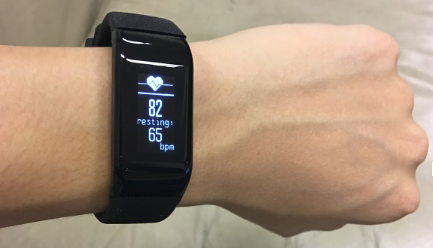
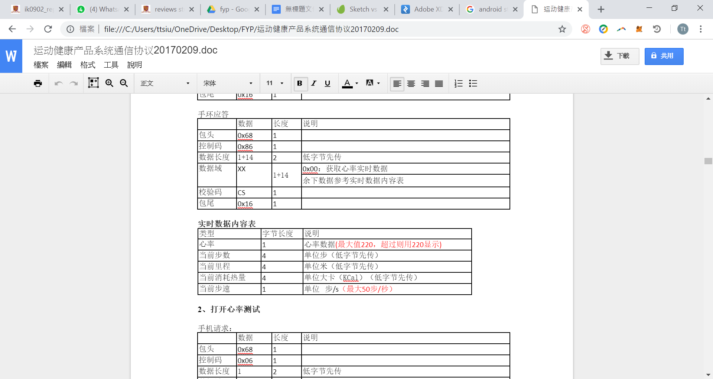
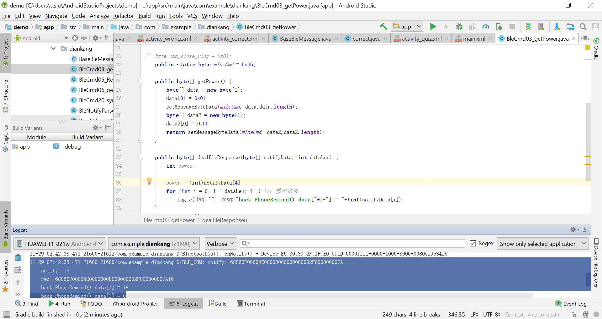
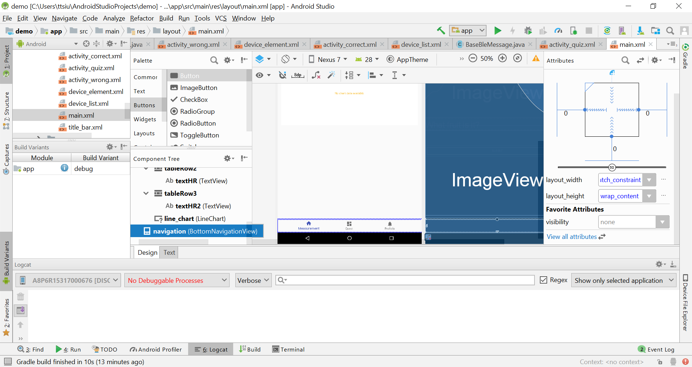
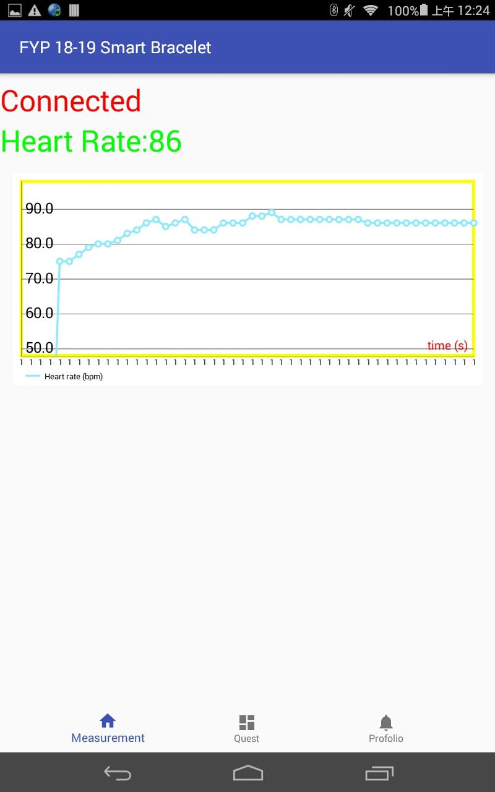
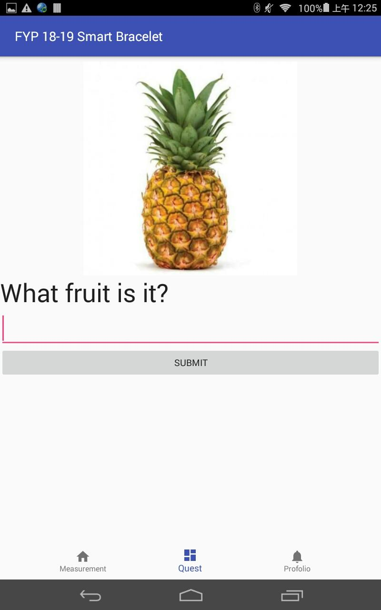
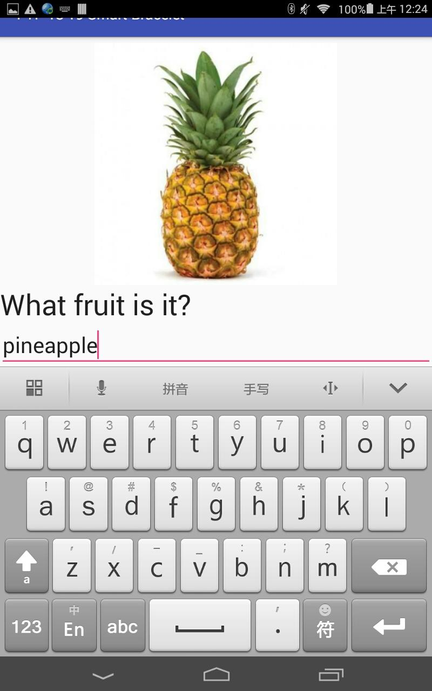
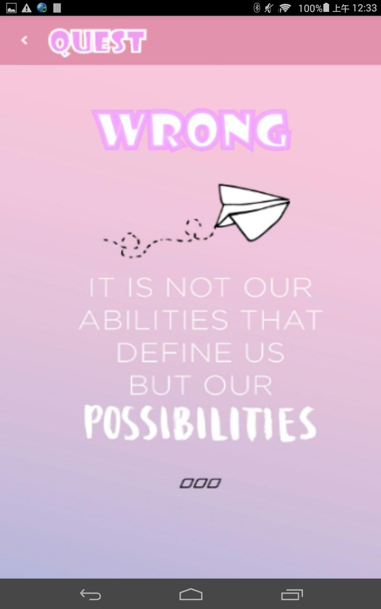
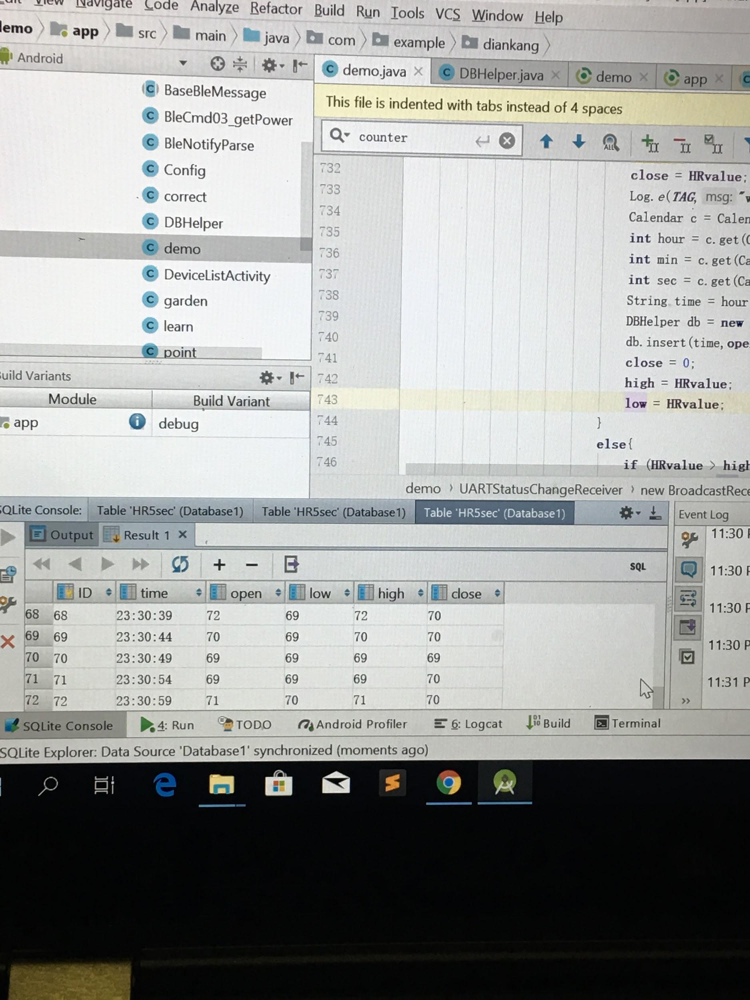
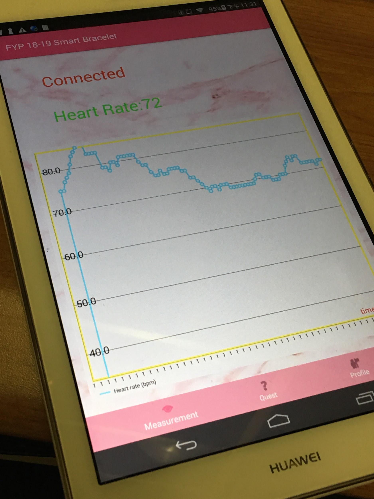

(Android app+Smart bracelet)

# Abstract

This project aim to study learning analytic methods or tools among the group of children with special educational need in an effective and scientific way. This project focuses on students with special education needs (SEN), in particular to children with Attention Deficit Hyperactivity Disorder (ADHD). Furthermore, this project aims to investigate the relationship between Physical status, which can be indicated by different physiological index, such as heartbeat, blood pressure, and Emotion, and how they can affect study performance.

# Develop android app

To obtain the physiological index, e.g. heart rate, blood pressure, motion sensor data, we choose smart bracelet as our measurement device.

(iii) heart rate measuring

# Connect to smart bracelet

The smart bracelet we obtained from online shop do not exactly provide a list of API which they claimed to provide, in fact, they only provide a documentation of communication protocol between the bracelet and Android device in HEX data and a simple source code about getting the battery level of the smart bracelet. That being the case, there are difficulties in understanding and implement the communication interface.

## Obtaining the heart rate data

According to the documentation, the procedure of getting the heart rate data are as below:

(i) send packet data 0x 68 06 01 00 01 70 16 to the smart bracelet to open the heart rate monitoring function

(ii) send packet data 0x 68 06 01 00 00 6f 16 to the smart bracelet to receive the heart rate data

(iii) the packet data similar to  0x 68 86 0e 00 46 00 00 00 00 00 00 00 00 01 00 00 00 00 43 16 will be returned, where 0x46=70bpm is the heart rate.

## Developing app interface

According to the app design protocol, bottom navigation bar is used. It will direct user to different page in a faster and smoother way.

In the measurement page, to represent the data in an informative way, chart is used. **MPAndroidChart** library is being used to represent the chart.

In the ‘quest’ page, user can answer to the question and submit to see the results. If the answer is correct, correct page will be shown and points will be added, else, wrong page will be shown.

 

 

# Storing time-series data to Android SQLite database for further analysis

# Time-series data analysis...
